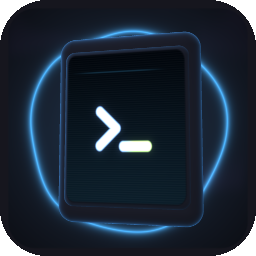
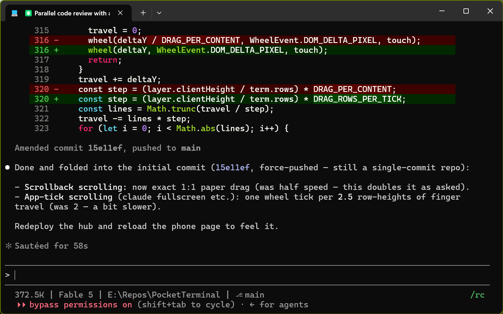
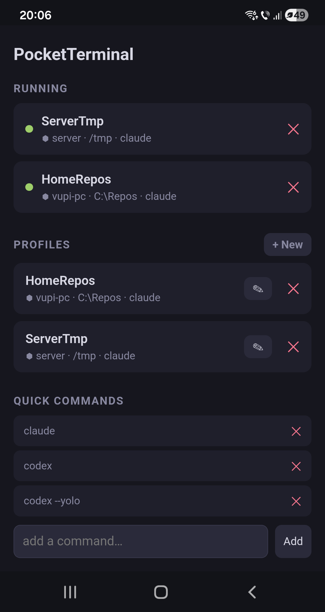
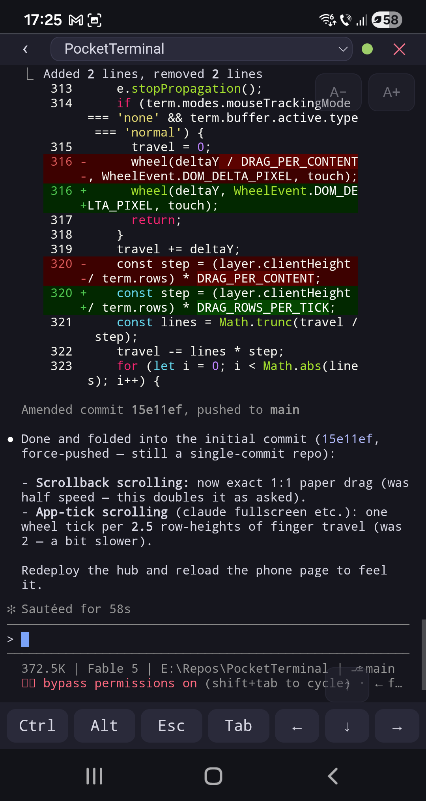

<p align="center">
  
</p>

# PromptPortal

Spawn a terminal window from your phone running on your PC; work remotely.
Open any terminal window from your PC; pick it up from your phone.
Use it for Claude Code, Codex or general terminal needs.

<p align="center"></p>
<table align="center">
  <tr>
    <td></td>
    <td></td>
  </tr>
</table>
<p align="center"><em>One shared pty from both ends: the session in Windows Terminal on the
workstation (top); the hub's home screen and the same session live in the
phone browser (below). Type in either.</em></p>

## Architecture

Three tiers:

- **Client** — the browser (phone). One page lists every session on
  every connected workstation; open one to view and drive it.
- **Hub**: Serves the UI, authenticates
  clients, and brokers browser sockets to workstations. It is the one piece you host,
  and for access from the open Internet, a TLS reverse proxy and an open port is required.
  Dokploy on a cloud VM (e.g. Hetzner), is a suggestion. Or, keep the server private with a VPN.
- **Workstations**, the machines where terminals actually run: `promptportal`, one self-contained executable.
  Every session is its own `promptportal` process owning its pty, dialing the hub over **WebSocket**;
  a small resident `promptportal launcher` per workstation exists so sessions can be started from the hub.
  The compose deployment also optionally includes one containerized workstation
  (`server`, in a separate container beside the hub).

```
  phone ─┐
         ├─(HTTPS/WSS)─▶  HUB  ◀─(outbound WSS per session + launcher)─┬─ Windows workstation "laptop"
 desktop ┘             hub.example.com                                  ├─ Windows workstation "desktop"
                                                                        └─ workstation "server" (its own container, beside the hub)
```

### Shared, cooperative control — and one owner

A session is one shared pty. Its terminal window on the workstation renders
it natively, the browser on your phone watches and types into the same
screen; output reaches both. "Take control remotely" is just opening the
session on your phone; "take control back" is typing at the workstation
again — the first keystroke snaps the pty back to the right window size.

**Closing the window ends the session**, everywhere, always.
There are no headless leftovers on a desktop: what you see in the taskbar
is exactly what exists.


## Docker (hub + `server` workstation)

The compose deployment runs two containers:

- **hub** — Serves the UI and brokers browsers to workstations;
  profiles and quick commands persist on the small `hub-data` volume.
- **workstation** — a coding workbench registered with the hub as `server`, so
  out of the box you get terminals on the server itself. It bundles Node,
  .NET 10, Python 3 + uv, `gh`, `tmux`, `ripgrep`, `jq`;
  Claude Code and Codex are installed onto the home volume at each container
  start. `/home/user` is a named volume, so auth, repos, and git config
  survive redeploys; running sessions do not.

```sh
cp .env.example .env   # set the two passwords
docker compose up -d --build
```

Configuration, via `.env` or the deploy platform's environment:

| Variable                          | Default  | Purpose                                                            |
| --------------------------------- | -------- | ------------------------------------------------------------------ |
| `PROMPTPORTAL_WEBACCESS_PASSWORD`   | required | Browsers sign in with it (username is always `promptportal`)         |
| `PROMPTPORTAL_WORKSTATION_PASSWORD` | required | Workstations (including the bundled `server` one) register with it |
| `PROMPTPORTAL_NODE_NAME`            | `server` | The bundled workstation's name in the UI                           |
| `PROMPTPORTAL_TRUST_PROXY`          | unset    | Set to `1` when a reverse proxy you control is the only way in: the brute-force lockout then keys on the client IP it appends to `X-Forwarded-For` instead of the proxy's address (see Security notes) |

The hub exposes three WebSocket paths on the same port: `/ws` (browser, token
auth), `/session` and `/launcher` (workstation, node-secret auth).

### Running the hub non-containerized

```sh
PROMPTPORTAL_WEBACCESS_PASSWORD='a-long-random-string' \
PROMPTPORTAL_WORKSTATION_PASSWORD='another-long-random-string' bun server.ts
```

The hub reads the variables above, plus:

| Variable          | Default            | Purpose                                   |
| ----------------- | ------------------ | ----------------------------------------- |
| `PROMPTPORTAL_PORT` / `PROMPTPORTAL_HOST` | `8080` / `127.0.0.1` | Listen port / address. Loopback by default — the hub speaks plain HTTP, so set `PROMPTPORTAL_HOST=0.0.0.0` only with TLS terminating in front |
| `PROMPTPORTAL_DATA` | `./data`           | Where profiles and quick commands persist |

The flags `--port N`, `--host ADDR`, and `--data DIR` override these.

On Windows, `.\windows\install.ps1 -InstallHub` (see workstation setup below)
hosts the hub as a background logon task instead: a self-contained
`windows\dist\hub.exe` serving loopback on 8080 (`-HubPort`), both passwords
in **Windows Credential Manager** (`hub.exe set-password`), data in
`%LOCALAPPDATA%\PromptPortal\hub-data`; the workstation half of the install
then defaults to this local hub.

### If using Tailscale, keep the hub private

You can publish it to your tailnet with `tailscale serve`, which adds TLS:

```sh
tailscale serve --bg 27180   # compose hub; bare `bun server.ts`: 8080
```

Use the resulting `https://<machine>.<tailnet>.ts.net` as the hub URL and set `PROMPTPORTAL_TRUST_PROXY=1`.

## Setting up a Windows workstation

MacOS is not implemented yet; support can be added in the future.

The workstation is **one self-contained executable** — `promptportal.exe` (TypeScript
compiled by Bun, ConPTY). `promptportal` in a terminal hosts a session right there
(native Windows Terminal, not a browser); `promptportal launcher` is the small
logon-task resident that starts sessions requested from the hub.

Prerequisite: [Bun](https://bun.sh) >= 1.3.14 (build-time only)

From a PowerShell in the repo (no elevation needed):

```powershell
.\windows\install.ps1 -HubUrl https://promptportal.example.com
```

It prompts for the workstation password, builds `windows\dist\promptportal.exe`,
persists the config (settings as user
environment variables, the password in **Windows Credential Manager**),
registers a **scheduled task** that runs `promptportal launcher` at logon, adds
`windows\dist` to your PATH, and installs a Windows Terminal
**PromptPortal profile** that opens a new connected session in a tab.

To ensure all windows you use are accessible remotely,
set **PromptPortal profile** as the default Windows Terminal profile.
For terminals launched from the command line, use `promptportal -- Write-Host Hello`.

A session created **remotely** (from the phone) opens as an interactive
window in the workstation's default terminal.

### Workstation configuration

The installer sets these; set them by hand to run `promptportal` unmanaged.

| Variable               | Default            | Purpose                                            |
| ---------------------- | ------------------ | -------------------------------------------------- |
| `PROMPTPORTAL_HUB_URL`   | unset              | Hub URL (`https://…` / `wss://…`; a bare host means `https`); unset = `promptportal` is a local-only terminal |
| `PROMPTPORTAL_WORKSTATION_PASSWORD` | required for hub | The hub's workstation password; on Windows prefer `promptportal set-password` (Credential Manager) over the env var |
| `PROMPTPORTAL_NODE_NAME` | sanitized hostname | This workstation's name in the UI                  |
| `PROMPTPORTAL_SHELL`     | platform default   | Shell each session hosts (default `powershell.exe` on Windows, `$SHELL`/`bash` elsewhere) |

### The `promptportal` command

```
promptportal [label] [--cwd DIR] [-- COMMAND ...]       host a session in this terminal
promptportal launcher                                   the logon-task resident (sessions from the hub)
promptportal set-password                               store the workstation password in Credential Manager
```

Everything after `--` is the command to run, taken verbatim — so
`promptportal work -- claude --dangerously-skip-permissions` needs no quoting.

`promptportal` turns the terminal it runs in into a PromptPortal session: the shell
runs on a pty owned by that process, the hub sees it immediately, and keys go
straight to the shell.

### Workstation logs

The launcher and every session host append to a shared log under
`~/.promptportal/logs`. Two files (`promptportal.0.log`, `promptportal.1.log`) rotate at 200k lines each.

## Security notes

There are two secrets: `PROMPTPORTAL_WEBACCESS_PASSWORD` signs browsers in
(Basic auth, username fixed to `promptportal`) and grants a shell on every
workstation; `PROMPTPORTAL_WORKSTATION_PASSWORD` registers workstation sessions
and launchers, and holding it lets an attacker impersonate a workstation —
make both long, random, and different. The hub itself speaks plain HTTP, and
Basic auth resends the web-access password with every request, which is why
TLS termination in front is mandatory.
The standalone hub listens on loopback by default: open it with `PROMPTPORTAL_HOST=0.0.0.0`, paired with
a TLS reverse proxy.

Failed attempts trip a brute-force lockout keyed on client IP.
Set `PROMPTPORTAL_TRUST_PROXY=1` so it keys on the client IP
the proxy — reverse proxy or `tailscale serve` — appends to `X-Forwarded-For`
(only when that proxy is the sole way in — otherwise attackers forge the
header and dodge the lockout).

Isolation of the workstation password from the spawned sessions is best-effort and not
hardened, but there is room for improvement.

**Planned:** browsers and workstations authenticating with a
GitHub identity instead of the shared secret.
